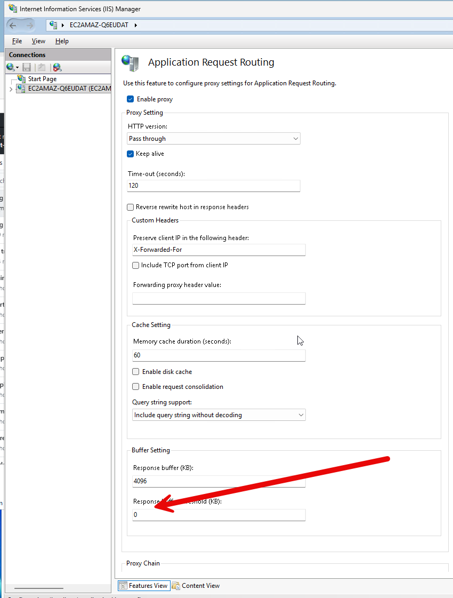

# Waitress WSGI Deployment Guide

This guide explains how to migrate from CGI to Waitress WSGI server to fix upload truncation issues.

## Why Waitress?

The CGI implementation had issues with ARR buffering on IIS causing uploaded images to be truncated. Waitress seems to not have these problems, and it is faster, but we do lose some simplicity and add more depancies. :/ Well at least it all goes away in 12 days. 

## Architecture

```
Browser -> IIS -> ARR Proxy -> Waitress -> app.py (WSGI app + static files)
```

We added code to the app.py to manually server our two static html files (upload.html and admin.html) and the style.css file. This is because Waitress doesn't serve static files by default.

## Installation Steps

### 1. Install Dependencies

```bash
cd D:\Github\cwandt-pocketfiche-site\upload-server
pip install -r requirements.txt
```

### 2. Configure Data Directory

```
set PF_DATA_DIR=D:\Github\cwandt-pocketfiche-site\testing-data-dir
```

to make it last between command window starts, use `setx`:

```bash
setx PF_DATA_DIR "D:\Github\cwandt-pocketfiche-site\testing-data-dir"
```

### 3. Test the Server Locally

```bash
start.bat
```

You should see:
```
Starting Waitress WSGI server...
  Host: 127.0.0.1
  Port: 8000
  Threads: 4
  Data directory: D:\Github\cwandt-pocketfiche-site\testing-data-dir
  URL: http://127.0.0.1:8000/
```

Test it works:
```bash
curl "http://localhost:8080/?command=get-parcels"
```

### 4. Configure IIS ARR Proxy

The `web.config` has been updated to proxy requests to Waitress.

**Verify ARR is installed:**
1. Open IIS Manager
2. Select your server
3. Look for "Application Request Routing Cache" icon


**Enable ARR proxy:**
1. Double-click "Application Request Routing Cache"
2. Click "Server Proxy Settings" in right panel
3. Check "Enable proxy"
4. Click "Apply"
5. Enable the proxy server under the SERVER features page.

**INstall URL rewriting module:**

1. Download and install URL Rewrite Module: https://www.iis.net/downloads/microsoft/url-rewrite
2. Open IIS Manager
3. Select your server
4. Look for "URL Rewrite" icon in the SITE features page. 
5. Add a rule going from the `upload/` directory to `http://localhost:8000/`

## Files Reference

- `app.py` - WSGI application
- `server.py` - Waitress startup script
- `start.bat` - Windows startup script
- `requirements.txt` - Python dependencies

